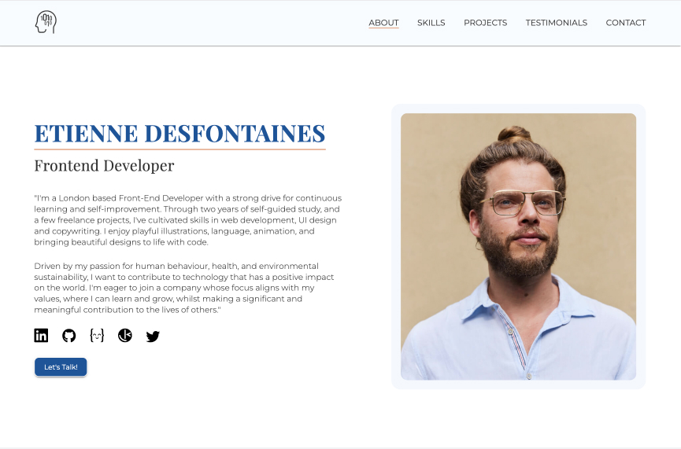

# Portfolio

## Table of contents

- [Overview](#overview)
- [Project Links](#links)
- [Development](#development)
- [What I Learned](#what-i-learned)
- [Issues](#issues)
- [To Do](#to-do)
- [Acknowledgments](#acknowledgments)
- [Author](#etienne-desfontaines)

## Overview

My front-end development portfolio website, created to showcase my work, give prospective employers an insight into my skills, tell them a little about who I am as a person and offer them a way to get in touch with me.

### My Roles:

- Designer
- Copywriter
- Developer

### Links

- [Live site](https://etiennedesfontaines.com/)

## Development

As an exercise in practicing the fundamentals of React and learning styled components, I built this project with a focus on both.

### Technologies Used:

- HTML5
- CSS3
- Sass
- JavaScript
- Styled Components
- React.js

### My process

I started with a pen and paper, breaking the design down into components and subcomponents, as best as I could recognize them. During this process I also attempted to define design patterns, such as repeated layouts, for which I could create utility components - LayoutRow.jsx and LayoutColumn.jsx seemed obvious choices.

#### JSX and Styled Components

I decided to build a static version of the site prior to adding any functionality. So, starting at the top, with the "Navbar", and working my way down to the "Footer", I created and styled each component.

#### Functionality

The simplicity of this single-page design required little functionality, so once the static site was built, my main task was to add state to data that, if changed, needed to reflect in the UI, add scroll functionality, Nav signifiers, and data submission handling for the contact form.

## What I learned

### React

- hinking in React: UI component hierarchy, identifying where state is needed, unidirectional data flow.

- JSX
- Components
- Conditional Rendering
- Dynamic Component Rendering
- Events
- Props and State
- Virtual DOM
- Hooks: useState, useEffect, useRef
- Rendering lists and unique keys for list items

### Components

Creating components that are maintainable and easy to understand and use is more challenging than I initially believed. There were many instances in this build during which I had to go back and refactor because the components I had created were creating unnecessary complexity. If I were to do it over, I would make different choices, but I suppose that is the positive spin off of any build that has resulted in valuable lessons.

### React Libraries

- React Responsive Carousel
- Framer Motion (Explored outside of the project, still to be implemented)

### Styled Components

- Component styling
- Global Styles
- Props Interpolation
- Conditional Styling

### Other:

- Intersection Observer
- I recognized that different tools become more or less valuable based on the problem being solved. For instance, there are cases where styled components may provide value, while in others, Sass may be a better styling tool. In the case of this build, I decided to use both.

## Issues

### Nav Signigiers

The navigation signifiers do not update correctly on certain screen sizes, especially when scrolling from the bottom to the top of the page. I used the Intersection Observer API to trigger state changes for the nav signifiers, but I encountered difficulties in finding a setting that works consistently on all screens. It may be necessary to explore alternative methods to achieve the desired behavior.

### Reset Scroll

The project card description scroll does not reset on touch screen devices.

### Firefox

It seems there is an issue with the website's style on the Firefox browser, leading to content appearing squashed and unappealing. The problem is yet to be identified, but the website works perfectly on Chrome, Safari, and Firefox Developer Edition.

It have attempted to inspect the CSS properties and layout on Firefox using its developer tools to pinpoint the problem. It seems cross-browser compatibility can sometimes be challenging, and specific CSS rules or browser-specific behaviors may be causing the issue. I will need to investigate further.

### Layout Component Gap

My choice to create and use LayoutComponents, and to define their flex-gap via props, resulted in me needing to programmatically change that gap value at different screen sizes (something I've not yet implemented), rather than doing it in my style declarations with the rest of the styling.

This seems unnecessarily complex and messy to me, and I would rather not have my styling declarations spread between JavaScript and CSS (Styled Components) - I think it makes it challenging to read and difficult to maintain. Lesson learned.

These were not the only components with which I suffered these complexities, which I created, but they are still unresolved.

### Handle Document Scroll

My function to handle document scroll works well enough, but on certain screen sizes, it stops higher above the section content than I would like, poorly framing it. This is due to using padding, rather than margin, to increase spacing between sections. There were a number of reasons for this choice, some rooted in unimplemented design choices, some due to working around complexities I created in my components.

I suppose I can either solve it with a good refactor, changing padding to margin, or with more nuanced programmatic control of my handleDocumentScroll function.

## To Do

### Animation

- Title: H1 animates from #$%\*\*@#%# to Etienne Desfontaines
- Project Cards: Even cards animate in from left, odd from right.
- Testimonials(Desktop): All stacked center, top two cards animate off the stack (moving right and left respectively) to create a row layout.

### Refactor:

- Implement a naming convention for better readability and maintainability.
- Remove unecessary repetition.
- simplify components

## Acknowledgments

My Brother Emile Desfontaines for his continued encouragement and guidance along my development journey. And the development community for all the incredible documentation that makes self-learning possible.

## Etienne Desfontaines

- [Website](https://etiennedesfontaines.com/)
- [Linkedin](https://www.linkedin.com/in/etienne-desfontaines-818349284/)
- [Frontend Mentor](https://www.frontendmentor.io/profile/etiennedesfontaines)
- [Exercism](https://exercism.io/profiles/etiennedesfontaines)
